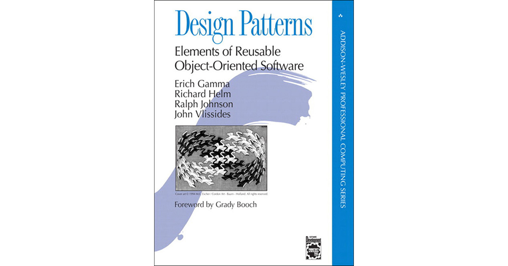

# 🎨 Design Patterns Repository

<div align="center">
  
</div>
<div align="center">
  <p>
    <a href="https://opensource.org/licenses/MIT">
      
    </a>
    <a href="https://github.com/kjarj54/desing-patterns/stargazers">
      
    </a>
    <a href="https://github.com/kjarj54/desing-patterns/network">
      
    </a>
    <a href="http://makeapullrequest.com">
      
    </a>
  </p>
</div>

## 📖 About

This repository contains practical implementations and examples of the **23 Gang of Four (GoF) Design Patterns** from the seminal book *"Design Patterns: Elements of Reusable Object-Oriented Software"* by Gamma, Helm, Johnson, and Vlissides.

The goal is to provide clear, well-documented examples of each design pattern implemented in multiple programming languages, making it easier to understand and apply these fundamental software design principles.

## 🎯 Purpose

- **Learn**: Understand the core concepts behind each design pattern
- **Practice**: Implement patterns in various programming languages
- **Reference**: Quick access to pattern implementations and explanations
- **Share**: Contribute to the software engineering community

## 🏗️ Pattern Categories

### 🔨 Creational Patterns
*Patterns that deal with object creation mechanisms*

| Pattern | Description | Status |
|---------|-------------|---------|
| **Abstract Factory** | Creates families of related objects | 🔄 Coming Soon |
| **Builder** | Constructs complex objects step by step | 🔄 Coming Soon |
| **Factory Method** | Creates objects without specifying exact classes | 🔄 Coming Soon |
| **Prototype** | Creates objects by cloning existing instances | 🔄 Coming Soon |
| **Singleton** | Ensures a class has only one instance | 🔄 Coming Soon |

### 🔧 Structural Patterns
*Patterns that deal with object composition*

| Pattern | Description | Status |
|---------|-------------|---------|
| **Adapter** | Allows incompatible interfaces to work together | 🔄 Coming Soon |
| **Bridge** | Separates abstraction from implementation | 🔄 Coming Soon |
| **Composite** | Composes objects into tree structures | 🔄 Coming Soon |
| **Decorator** | Adds behavior to objects dynamically | 🔄 Coming Soon |
| **Facade** | Provides a simplified interface to a complex subsystem | 🔄 Coming Soon |
| **Flyweight** | Minimizes memory usage by sharing common data | 🔄 Coming Soon |
| **Proxy** | Provides a placeholder or surrogate for another object | 🔄 Coming Soon |

### 🎭 Behavioral Patterns
*Patterns that deal with communication between objects*

| Pattern | Description | Status |
|---------|-------------|---------|
| **Chain of Responsibility** | Passes requests along a chain of handlers | 🔄 Coming Soon |
| **Command** | Encapsulates requests as objects | 🔄 Coming Soon |
| **Interpreter** | Defines a grammar and interpreter for a language | 🔄 Coming Soon |
| **Iterator** | Provides a way to access elements sequentially | 🔄 Coming Soon |
| **Mediator** | Defines how objects interact with each other | 🔄 Coming Soon |
| **Memento** | Captures and restores object state | 🔄 Coming Soon |
| **Observer** | Notifies multiple objects about state changes | 🔄 Coming Soon |
| **State** | Allows objects to alter behavior when state changes | 🔄 Coming Soon |
| **Strategy** | Defines a family of algorithms | 🔄 Coming Soon |
| **Template Method** | Defines skeleton of algorithm in base class | 🔄 Coming Soon |
| **Visitor** | Defines operations on elements of an object structure | 🔄 Coming Soon |

## 💻 Programming Languages

Each pattern will be implemented in multiple languages to demonstrate language-specific approaches:

- 🟨 **JavaScript/TypeScript**
- ☕ **Java**
- 🐍 **Python**
- 🅲 **C#**
- 🎯 **C++**

## 📁 Repository Structure

```
📦 desing-patterns/
├── 📂 abstract-factory/
│   ├── 📂 javascript/
│   ├── 📂 java/
│   ├── 📂 python/
│   └── 📄 README.md
├── 📂 builder/
├── 📂 adapter/
├── 📂 bridge/
├── 📂 chain-of-responsibility/
├── 📂 command/
└── 📄 README.md
```

## 🚀 Getting Started

1. **Clone the repository**
   ```bash
   git clone https://github.com/kjarj54/desing-patterns.git
   cd desing-patterns
   ```

2. **Navigate to a pattern**
   ```bash
   cd creational/singleton
   ```

3. **Choose your language**
   ```bash
   cd javascript  # or java, python, etc.
   ```

4. **Run the example**
   ```bash
   # Follow the README instructions in each pattern folder
   ```

## 📚 Learning Resources

- 📖 **Book**: [Design Patterns: Elements of Reusable Object-Oriented Software](https://www.amazon.com/Design-Patterns-Elements-Reusable-Object-Oriented/dp/0201633612)
- 🌐 **Website**: [Refactoring.Guru - Design Patterns](https://refactoring.guru/design-patterns)
- 📺 **Videos**: [Design Patterns Video Series](https://www.youtube.com/playlist?list=PLF206E906175C7E07)

## 🤝 Contributing

Contributions are welcome! Please feel free to submit a Pull Request. Here's how you can contribute:

1. **Add new language implementations**
2. **Improve existing examples**
3. **Add documentation**
4. **Fix bugs or typos**
5. **Suggest new features**

### Contribution Guidelines

- Follow the existing folder structure
- Include comprehensive README for each pattern
- Add comments explaining the pattern implementation
- Provide real-world examples when possible
- Write clean, readable code

## 🎨 Code Quality

- ✅ **Clean Code**: Following best practices
- 📝 **Documentation**: Comprehensive README files
- 🧪 **Examples**: Real-world use cases
- 🔍 **Code Reviews**: All contributions reviewed

## 📄 License

This project is licensed under the MIT License - see the [LICENSE](LICENSE) file for details.


---

<div align="center">
  <p>⭐ Star this repository if you find it helpful!</p>
  <p>🔄 Fork it to contribute your own implementations!</p>
  <p>📢 Share it with fellow developers!</p>
</div>

*"Each pattern describes a problem which occurs over and over again in our environment, and then describes the core of the solution to that problem, in such a way that you can use this solution a million times over, without ever doing it the same way twice."* - Christopher Alexander
